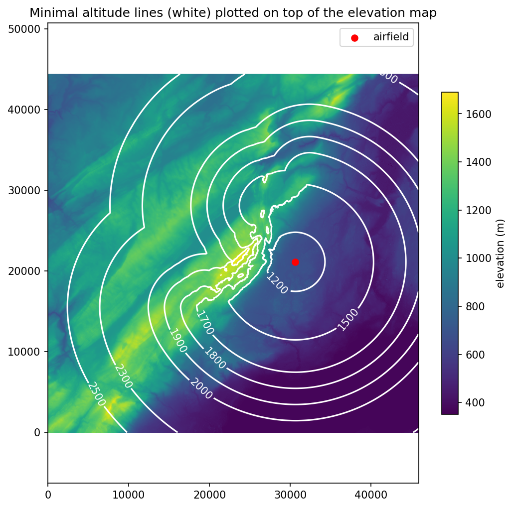

# Welcome to the *glikonal* repository!
This code computes the minimal altitude for an unpowered aircraft to return to an airfield.
It also computes the paths to follow for a safe re-entry.
The code is mainly built on top of the *pykonal* library available [here](https://github.com/malcolmw/pykonal).
This code implements a modified Fast Marching Method (FMM; Sethian *et al.*, 1996) for solving the eikonal equation in Cartesian coordinates, with an elevation constraint.


## Installation

Download and unzip the [latest release](https://github.com/giovannipiccioli/glikonal/releases "Releases").
Then in the terminal execute
```bash
 cd path/to/glikonal
 pip install .
```
## Disclaimer
This software has the potential to be used in safety critical applications. Let us stress that no guarantee of correctness is provided. In no case the author of this software shall be held liable for the direct or indirect consequences of its use. This software is provided by the copyright holders and contributors “as is” and any express or implied warranties, including, but not limited to, the implied warranties of merchantability and fitness for a particular purpose are disclaimed. In no event shall the copyright owner or contributors be liable for any direct, indirect, incidental, special, exemplary, or consequential damages. See the LICENSE file for more information.


## Tutorials
The folder "gliding_distance" contains two jupyter notebooks that explain how to use the library.
### Artificial data
To better understand how the algorithm works one can start from artificial examples. In the notebook "examples_min_return_altitude.ipynb", we look at the case of no terrain, a single mountain peak and a mountain range with two saddles.

This notebook goes though these various examples fo elevation profile, to show how glikonal computes the minimal altitude for re-entry to an airfield and the re-entry paths.
Let us provide some pictures of this below.
For an elevation profile with a single peak, and glide ratio of 1, we can plot the minimal altitude contour lines (in white), on top of the elevation map (color indicates elevation).

We see that on the left side (that is, where there si no mountain) the minimal altitude lines are concentric circles, exactly as one would expect in the case of the classical gliding cone). Then the lines wrap around the mountain peak. 
A 3D visualization of the gliding cone is provided by the following plot.


The computation of the minimal altitude leaves one open question: if I'm at the minimal altitude, which path should I take for a safe re-entry to the airfield?

We can compute these paths and plot them on top of the elevation profile. The algorithm is conceived so that the glide ratio required on each path is not more than the glide ratio given as input to the algorithm (1 in the present case). Also the paths will maintain separation with terrain.

One sees how the paths avoid the mountain peak by passing around it.

A more interesting example is that of a mountain range with two saddles (one saddle higher than the other). One must then choose from which saddle to pass when coming back to the airfield. 
We can again plot the minimal altitude surfae, on top of the elevation profile.


Plotted in 2D this gives

We also look at the reentry paths. In this case if one is at the right of the mountain range, she must choose which saddle to use for the reentry (which depends on the height on the saddle in addition to the distance form the starting point).

The algorithm provides an answer to this problem as shown in the following figure. 


### Real data
The notebook "gliding_distance_real_airport.ipynb" contains the code to download topographical (elevation) data and run the algorithm. The procedure outlined can be applied to any airfield in the world. As an example we consider the airfield of Montricher (LSTR) in Switzerland.
This airfield has the property of having a mountain range to its north west, making it tricky to estimate the minimal re-entry altitude when one is in this mountainous area. 
This airfield is located at 667 m AMSL. We suppose a glide ratio of 20 and we ask to maintain a height of 300m AGL during the whole re-entry path. Also we ask to arrive at the airport at a height of 350m AGL. 

Below we plot the minimal altitude lines obtained for this setting

To make the plot more readable we superimpose the minimal altitude lines on top of a normal map

One sees how the circles, coming from the usual gliding cone, are obtained in absence of obstacles. Instead the minimal latitude lines change shape in presence of mountains.

Below we also plot the re-entry paths to the airport


## Bugs
Please report bugs, feature requests, and questions through the [Issues](https://github.com/giovannipiccioli/glikonal/issues "Glikonal Issues tracker") tracker.

## References
1. Sethian, J. A. (1996). A fast marching level set method for monotonically advancing fronts. *Proceedings of the National Academy of Sciences, 93*(4), 1591–1595. https://doi.org/10.1073/pnas.93.4.1591
2. White, M. C. A., Fang, H., Nakata, N., & Ben-Zion, Y. (2020). PyKonal: A Python Package for Solving the Eikonal Equation in Spherical and Cartesian Coordinates Using the Fast Marching Method. *Seismological Research Letters, 91*(4), 2378-2389. https://doi.org/10.1785/0220190318

